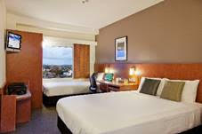

.. title: Hotel Information
.. slug: hotel-information
.. date: 2015-12-10 10:10:18 UTC+13:00
.. tags: draft
.. category: 
.. link: 
.. description: 
.. type: text

.. contents::

Conference rates
================

Please use the code **EVENTZ** when booking with the **Ibis** or **Novotel** hotel
listed below for receiving a special conference rate. 

More details can be found `here <link://slug/hotel-conference-rate>`__.

College Hall
============

College Hall is student accommodation on campus. Therefore it is only a stone's
throw away from the conference venue. But it is also close to bus stops if you
would want go to elsewhere.

More information
----------------

Accommodation and Conference Services

.. image:: ../../images/phone.png
   :height: 16px
   :align: left

+64 7 838 4910

conference@waikato.ac.nz

http://www.waikato.ac.nz/sasd/acso/hor_collegehall.shtml

Novotel Hamilton Tainui
=======================

Novotel Tainui Hamilton is the only 4.5 star hotel in Hamilton. It is located
in the heart of the Hamilton city centre, only minutes from shopping and
entertainment. The preferred choice for business travellers, and an
internationally recognised brand, Novotel Tainui Hamilton has 177 spacious,
well-appointed guest rooms with 24 hour reception, gym, spa, sauna and on-site
parking. The hotel’s popular restaurant and bar offer options for contemporary
dining in-house.

On-site facilities include Restaurant on Alma, the Lobby Bar, Health club
including gymnasium, spa, sauna and massage by appointment.

More information
----------------

.. image:: ../../images/bus.png
   :height: 16px
   :align: left

You can take the bus (line 13 and 2 stop on Victoria_ St) to the conference venue
or hail a cab.

Abby Camp

.. image:: ../../images/phone.png
   :height: 16px
   :align: left

+64 7 838 1366

h2159-re2@accor.com

.. image:: ../../images/money.png
   :height: 16px
   :align: left

Preferential code for conference delegate rate: **EVENTZ**

http://www.accorhotels.com/gb/hotel-2159-novotel-hamilton-tainui/index.shtml

Ibis Hamilton Tainui
====================

Ibis Tainui Hamilton is Hamilton’s leading 3.5 star hotel. The hotel holds
prime position overlooking the Waikato River and is a stone’s throw from the
city’s restaurants, bars and shopping.

The hotel offers 126 modern, spacious and comfortable guest rooms. Take
advantage of the welcoming atmosphere of the restaurant and bar with an outdoor
covered terrace, perfect for alfresco dinners or post conference drinks
overlooking the Waikato River.

More information
----------------

.. image:: ../../images/bus.png
   :height: 16px
   :align: left

You can take the bus (line 13 and 2 stop on Victoria_ St) to the conference venue
or hail a cab.

Abby Camp

.. image:: ../../images/phone.png
   :height: 16px
   :align: left

+64 7 838 1366

h2159-re2@accor.com

.. image:: ../../images/money.png
   :height: 16px
   :align: left

Preferential code for conference delegate rate: **EVENTZ**

http://www.accorhotels.com/gb/hotel-6690-ibis-hamilton-tainui/index.shtml

.. _Victoria: https://www.google.co.nz/maps/dir/Hotel+ibis+Hamilton+Tainui,+18+Alma+Street,+Hamilton+3204/206+Victoria+Street,+Hamilton/@-37.7870238,175.281282,17z/data=!3m1!4b1!4m13!4m12!1m5!1m1!1s0x6d6d18a4cb60f37f:0xe9e2fc2dc607ff35!2m2!1d175.2825073!2d-37.7852144!1m5!1m1!1s0x6d6d18ba83b0ab71:0xf278900f36f7794e!2m2!1d175.2847553!2d-37.7887532

.. _Wellington: https://www.google.co.nz/maps/dir/Aspen+Manor+Motel,+Hamilton/18+Wellington+St,+Hamilton+East,+Hamilton+3216/@-37.7961205,175.2917976,17z/data=!3m1!4b1!4m13!4m12!1m5!1m1!1s0x6d6d18ca5d00ee6b:0x1455d1fcc1dee71e!2m2!1d175.294111!2d-37.7967909!1m5!1m1!1s0x6d6d18ca0d73dda3:0xf1bcaa6fa6b64420!2m2!1d175.2935012!2d-37.7957782

